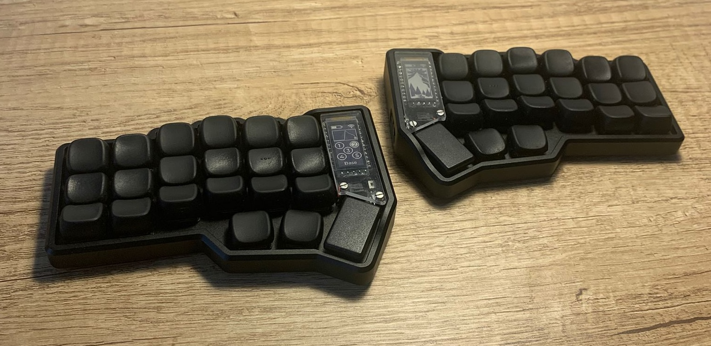

# Corne
ZMK config for my daily driver keyboard
- Case and Components from [Typeractive](https://typeractive.xyz/)
- Black Resin [KLP Lamé](https://github.com/braindefender/KLP-Lame-Keycaps) Keycaps printed from [JLCPCB](https://jlcpcb.com/)

